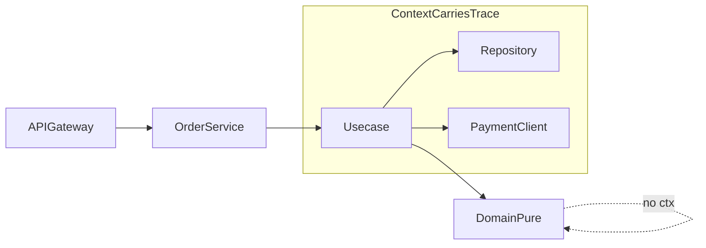

# Tracing design — Order Processing Service

## Context propagation

Trace context flows on **`context.Context`** using the W3C Trace Context standard (`traceparent` / `tracestate`). The API gateway and each service **extract** incoming headers into `ctx` and **inject** outgoing headers so Inventory and Payment participate in one distributed trace.



## Where should trace context live?

### 1. Usecases — **Option A: `context.Context`**

**Choice:** Option A — read the active span with `trace.SpanFromContext(ctx)` (or start children with `Tracer().Start(ctx, name)`).

**Why:** Idiomatic Go; matches OpenTelemetry and HTTP/gRPC instrumentation; avoids a parallel `TraceContext` parameter on every method; composes with deadlines and cancellation.

Option B (explicit `TraceContext` parameter) duplicates what `context` already carries and clutters signatures. Option C (`TracedInteractor` wrapper) is useful for **cross-cutting** decoration at the composition root, but the actual propagation still uses **context** inside `Execute`; the wrapper mainly centralizes span naming.

### 2. Domain methods — **none of A/B/C *inside* domain**

**Choice:** Domain stays **pure**: no `context.Context`, no tracing types, no OpenTelemetry imports.

**Why:** Clean Architecture and testability: domain expresses business rules only. Infrastructure concerns (tracing, logging, metrics) belong in application and adapter layers.

### 3. Repository methods — **Option A: `context.Context`**

**Choice:** Repositories take `ctx context.Context` for **timeouts, cancellation, and tracing** as child spans of the usecase span (e.g. `db.QueryContext`).

### 4. Tracing domain logic *without* passing context into domain

Two approaches:

1. **Span around the call (application/usecase):** Start a span immediately before invoking a pure domain method and end it after return. The domain function signature stays `(in) (out, err)` with no `ctx`.

2. **Domain events / facts:** The domain returns events or DTOs (e.g. `OrderCompleted{OrderID}`). The usecase records `span.AddEvent` or child spans **after** the domain call, mapping events to telemetry outside the domain.

## Implementation (this repo)

[`observability/tracing.go`](observability/tracing.go) provides:

- `Tracer`, `SpanFromContext`, `StartSpan` — integrate with global `otel` tracer provider set at startup.
- `InjectHTTP` / `ExtractHTTP` — propagate W3C headers on REST calls to Inventory and Payment.
- `RunInSpan` — wraps a block (e.g. domain invocation) in a child span without importing OTel in domain code.

**Example (usecase, Option A):**

```go
func (uc *CreateOrder) Execute(ctx context.Context, req *Request) error {
    ctx, span := observability.Tracer("order-processing").Start(ctx, "CreateOrder.Execute")
    defer span.End()

    order, err := domain.NewOrder(req.CustomerID, req.Lines)
    if err != nil {
        return err
    }
    return observability.RunInSpan(ctx, "domain.Order.Validate", func(context.Context) error {
        return order.Validate() // pure — no ctx
    })
}
```

Bootstrap (application main): register OTLP or stdout exporter and set `otel.SetTracerProvider(...)`, `otel.SetTextMapPropagator(propagation.NewCompositeTextMapPropagator(...))`.
